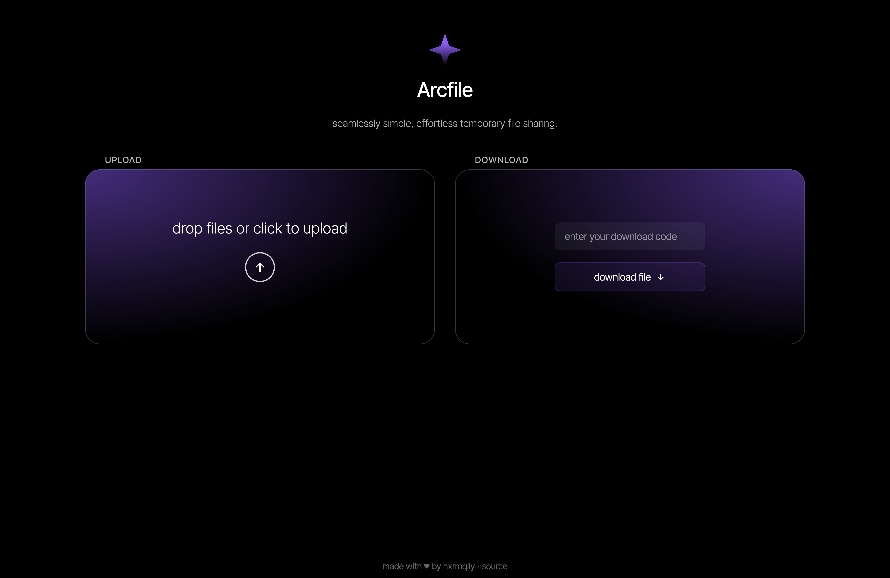
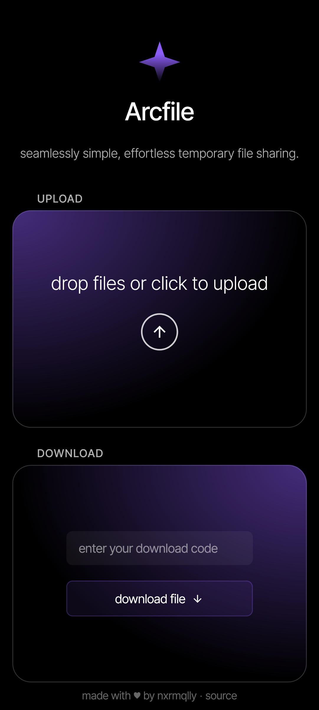

# Arcfile

> ✨ seamlessly simple, effortless temporary file sharing.


<details>
  <summary>📱 Mobile Screenshot</summary>


</details>

## Prerequisites

### If using Docker:
- [Docker](https://docs.docker.com/get-docker/) installed on your system
- [Docker Compose](https://docs.docker.com/compose/install/) installed

### If running manually:
- [Go](https://go.dev/dl/) installed (version 1.23.5+ recommended)
- [PostgreSQL](https://www.postgresql.org/download/) installed and running


##  Running Arcfile

<details>
  <summary>🐳 Using Docker</summary>

1. **Clone the repository:**
   ```sh
   git clone https://github.com/nxrmqlly/arcfile.git
   cd arcfile
   ```

2. **Start the services:**
   ```sh
   docker-compose up -d --build
   ```
   This will build and start both the database and the API service.


3. **Stop the services:**
   ```sh
   docker-compose down
   ```

</details>

<details>
  <summary>💻 Running Manually</summary>

1. **Start PostgreSQL**
   - Ensure PostgreSQL is running locally with the following credentials:
     - **User:** `youruser`
     - **Password:** `yourpassword`
     - **Database:** `yourdb`
     - **Port:** `5432`

   If using `psql`, you can create the database manually:
   ```sh
   psql -U youruser -c "CREATE DATABASE yourdb;"
   ```

2. **Clone the repository:**
   ```sh
   git clone https://github.com/nxrmqlly/arcfile.git
   cd arcfile
   ```

3. **Set up environment variables:**
   ```env
    # Your PostgreSQL database connection string
    DATABASE_URL=postgres://youruser:yourpassword@db:5432/yourdb

    # Gin mode: log levels, basically
    GIN_MODE=release

    # Set to true to listen on all interfaces (0.0.0.0), or false for localhost only
    HOST=true 
   ```

4. **Build and run the application:**
   ```sh
   go mod download
   go build -o main ./cmd/api/main.go
   ./main
   ```

</details>


## API Endpoints
After running the service, the API should be accessible at:
- **Base URL:** `http://localhost:8080`
- **API Routes** `/api`


Acknowledgments

- Thanks to @aryan-madan for help with frontend ([web](https://aryanmadan.vercel.app))

- Thanks to @deitrix (Big Phil) for help with the database